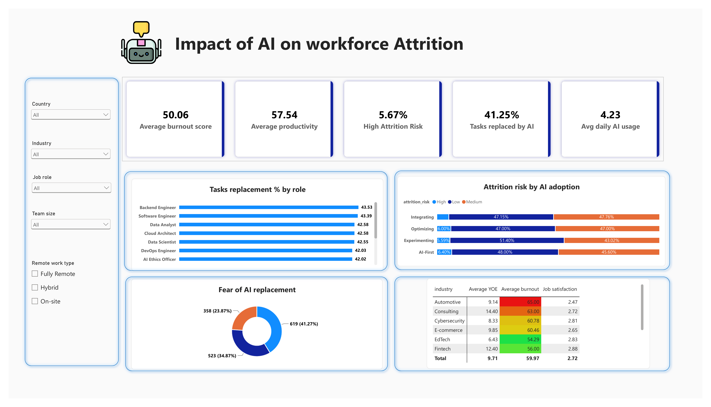

# Impact of AI Adoption on Workforce Attrition

An end-to-end data analytics project that measures how AI adoption relates to employee burnout, job satisfaction, fear of job displacement, and attrition risk. It combines **SQL (Google BigQuery)**, a **Power BI dashboard**, and a **GenAI Q&A layer** (Gemini 2.5 Pro on Vertex AI) served through a **Streamlit** app.

## 🎯 Business Problem

Organizations are adopting AI quickly, and early efficiency gains often take priority over workforce impact. Rising burnout, fear of replacement, and attrition are possible side effects, yet companies at different stages of AI maturity have little visibility into how these transitions affect wellbeing and retention.

## 🚀 Objective

Evaluate the hidden costs of AI adoption by examining how AI usage intensity, tool dependency, and organizational AI maturity influence:

- Employee burnout
- Perceived job security
- Job satisfaction
- Attrition risk

## 🗂️ Dataset

- 1,500 tech-sector employees (2026), stored in Google BigQuery
- 20 fields covering role and organizational context (job role, industry, company size, remote work type, salary), AI usage (primary tool, hours of daily AI assistance, % of tasks replaced by AI, AI adoption stage, weekly upskilling hours), and outcomes (productivity, burnout, job satisfaction, fear of AI replacement, attrition risk)
- Data profiling: row count check and a null audit across all 20 columns before analysis

## 🛠️ Tech Stack

| Stage | Tool | Purpose |
|---|---|---|
| Storage and analysis | Google BigQuery (SQL) | Data profiling, KPIs, segmentation queries |
| Visualization | Power BI (DAX) | Interactive dashboard with slicers |
| Automation | Python, Google Colab | Run BigQuery queries into pandas, build prompt context |
| Generative AI | Gemini 2.5 Pro (Vertex AI) | Answer business questions grounded in the query results |
| Delivery | Streamlit, ngrok | Web app combining the dashboard and a question box |

## 🔍 Approach

1. **Explore and validate** the data in BigQuery (row counts, null checks).
2. **Calculate KPIs** in SQL: average burnout, average productivity, % high attrition risk, average daily AI hours, average % of tasks replaced by AI.
3. **Answer four business questions** with SQL:
   - Which roles have the most tasks replaced by AI?
   - How does attrition risk vary by AI adoption stage?
   - How widespread is fear of AI replacement?
   - Which industries have the most burnt-out, dissatisfied employees among those at high attrition risk?
4. **Build the Power BI dashboard** with DAX measures and slicers for country, industry, job role, team size, and remote work type.
5. **Add a GenAI layer:** query results are converted to text context and passed to Gemini with a "senior data analyst" prompt that requires short, structured answers using only the provided data.
6. **Serve it** in a Streamlit app that shows the dashboard next to a question box.

## 📊 Key Findings

| KPI | Value |
|---|---|
| Average burnout score | 50.06 |
| Average productivity score | 57.54 |
| High attrition risk | 5.67% |
| Tasks replaced by AI | 41.25% |
| Average daily AI usage | 4.23 hours |

- 😟 **Fear outpaces attrition:** about 65% of employees report medium or high fear of AI replacement (41.27% medium, 23.87% high), yet only 5.67% are at high attrition risk.
- 📈 **Maturity is not a fix:** high attrition risk stays between 5.08% and 6.40% across Experimenting, Integrating, Optimizing, and AI-First stages.
- 🚗 **Automotive is the hotspot:** among employees with high fear and high attrition risk, Automotive has the highest burnout (65.00) and lowest job satisfaction (2.47), with Consulting and SaaS also elevated. This cohort is small (85 employees at high attrition risk overall), so treat industry averages as directional.
- 👥 **Exposure varies by role:** engineering roles report the most tasks replaced (about 42-43.5%); Prompt Engineers, AI Researchers, and Product Managers report the least (about 36-38.5%).

## 🤖 GenAI Q&A Example

**Question:** How can the automotive industry reduce the risk of attrition?

**Response (abridged):** Automotive has the highest burnout (65.00) and lowest satisfaction (2.47), a critical welfare issue and a primary attrition driver. Use AI to automate replaceable tasks to reduce workload, and communicate clearly to manage fear of replacement.

## ▶️ How to Run

1. Load the dataset into BigQuery (`my_db.workforce`).
2. Open the notebook in Google Colab and authenticate with your Google account.
3. Set `PROJECT_ID` and `LOCATION` to your own Google Cloud project, with the Vertex AI API enabled.
4. Run the queries, then launch the Streamlit app (`streamlit run app.py`).

> 🔒 **Security:** never commit API keys, ngrok tokens, or project credentials. Store secrets in environment variables or Colab secrets.

## 👩‍💻 Author

**Meenu** — Data Scientist, Helsinki, Finland
[LinkedIn](https://www.linkedin.com/in/meenu-meenu-datascientist/) | [GitHub](https://github.com/meenu-ds)
